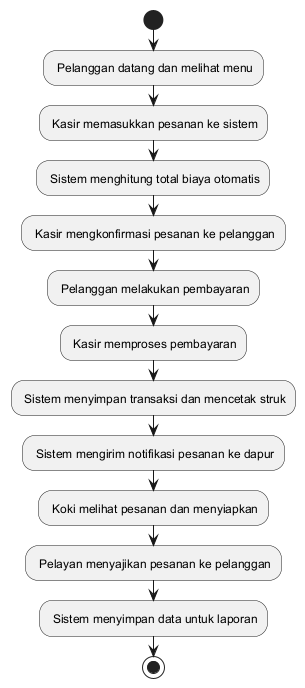
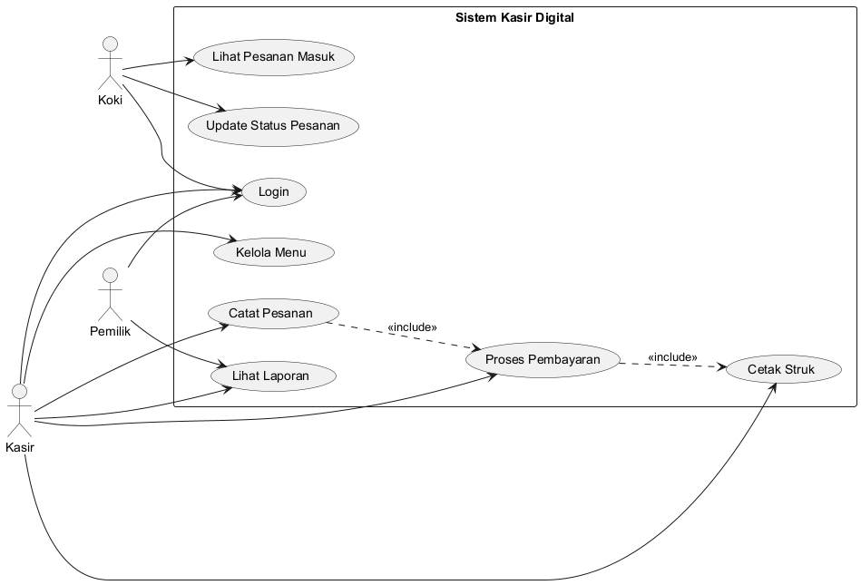
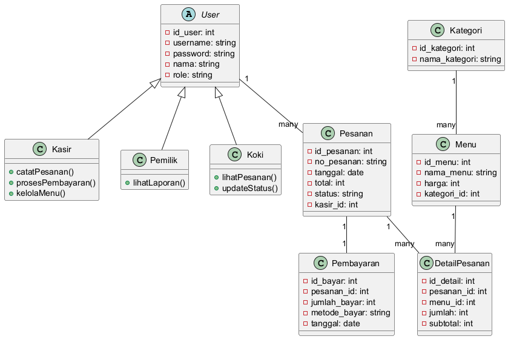
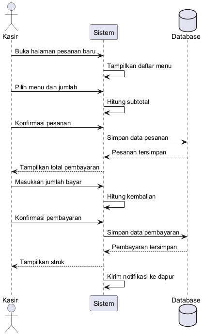

## Penelitian Terkait

Penelitian terkait yang relevan dengan sistem kasir digital dan Point of Sale berbasis web disajikan pada tabel berikut:

| No | Judul | Penulis | Tahun | Hasil |
|----|-------|---------|-------|-------|
| 1 | Implementasi Aplikasi Kasir Berbasis Web pada UMKM Menggunakan Metode Prototype | Arafat, Y., Rizky, H., & Nurhayati, T. | 2021 | Aplikasi kasir berbasis web berhasil meningkatkan efisiensi transaksi dan mengurangi kesalahan pencatatan pada UMKM |
| 2 | Implementasi Sistem Point of Sale pada UMKM | Puspita, D. | 2021 | Sistem POS mampu meningkatkan efisiensi operasional pada sektor UMKM secara signifikan |
| 3 | Desain User Interface dan User Experience Berbasis Web Menggunakan Figma untuk Aplikasi Kasir UMKM | Dillah, M., & Fauzan, M. | 2022 | Desain UI/UX yang baik pada aplikasi kasir meningkatkan kemudahan penggunaan bagi pengguna UMKM |
| 4 | Point of Sale Application for MSMEs with Payment Gateway Integration and NoSQL-Based | Briliansyah, I., & Avianto, D. | 2024 | Integrasi payment gateway pada sistem POS memperluas opsi pembayaran bagi pelanggan UMKM |
| 5 | UI/UX Design for Point of Sale and Bookkeeping of Kasirmu Application | Algiansyah, M. T. | 2024 | Desain UI/UX pada aplikasi POS Kasirmu memudahkan pencatatan keuangan UMKM |
| 6 | Integrasi Kasir Pintar Untuk Peningkatan Daya Saing UMKM Warung Kuliner | Jaza', M. M., dkk. | 2024 | Sistem kasir pintar meningkatkan daya saing UMKM warung kuliner melalui digitalisasi transaksi |
| 7 | Perancangan Sistem Manajemen Kasir Point of Sale Berbasis Web Dengan Metode Agile Development Scrum | Sulastri, R., & Suharto, A. | 2024 | Metode Agile Scrum efektif dalam pengembangan sistem POS untuk warung UKM |
| 8 | Pengembangan Sistem Kasir Berbasis Digital Untuk Mempermudah Transaksi Penjualan di Warung | Ashadi, N. R. | 2025 | Sistem kasir digital dengan model Prototype mendapatkan nilai kelayakan 83,75% |
| 9 | Rancang Bangun Sistem Informasi Point of Sales Berbasis Web Pada Toko Sembako Putri | Kumaini, I. K., Mutamassikin, & Triadi, A. | 2025 | Sistem POS berbasis web dengan metode RAD mendapatkan nilai kelayakan 88% |
| 10 | Rancang Bangun Sistem Point of Sales Laundry Berbasis Web Menggunakan Metode Agile | Wardana, I. G. N. W., dkk. | 2025 | Metode Agile efektif dalam pengembangan sistem POS berbasis web pada usaha laundry |

## Perancangan Sistem

Perancangan sistem kasir digital berbasis web pada Warung Soto Pak Antok menggunakan pendekatan berorientasi objek dengan Unified Modeling Language (UML). Sistem ini dirancang untuk menggantikan sistem pencatatan manual yang selama ini berjalan dengan sistem yang terkomputerisasi dan terintegrasi. Perancangan sistem mencakup pemodelan proses bisnis, struktur data, dan interaksi antar komponen sistem.

### Flowchart Sistem Usulan

Flowchart sistem usulan menggambarkan alur proses bisnis setelah penerapan sistem kasir digital. Berikut adalah alur sistem yang diusulkan:

1. Pelanggan datang dan melihat menu yang tersedia.
2. Kasir memasukkan pesanan pelanggan ke dalam sistem.
3. Sistem secara otomatis menghitung total biaya pesanan berdasarkan menu yang dipilih dan jumlahnya.
4. Kasir mengkonfirmasi pesanan kepada pelanggan.
5. Pelanggan melakukan pembayaran.
6. Kasir memproses pembayaran melalui sistem.
7. Sistem mencatat transaksi dan mencetak struk pembayaran.
8. Pesanan diteruskan ke bagian dapur melalui tampilan sistem.
9. Koki melihat pesanan yang masuk dan menyiapkan pesanan.
10. Setelah pesanan selesai, pelayan menyajikan kepada pelanggan.
11. Sistem secara otomatis menyimpan data transaksi untuk laporan.

{ width=11cm }

### Use Case Diagram

Use case diagram menggambarkan interaksi antara aktor dengan sistem yang akan dibangun. Use case diagram menunjukkan fungsionalitas sistem dari perspektif pengguna.

{ width=10cm }

### Penjelasan Use Case

Aktor yang terlibat dalam sistem ini terdiri dari:

1. **Kasir**: Merupakan aktor utama yang bertanggung jawab dalam proses transaksi penjualan. Kasir dapat melakukan login ke sistem, mengelola data menu makanan dan minuman, mencatat pesanan pelanggan, memproses pembayaran, melihat laporan penjualan, dan mengelola data pelanggan.

2. **Pemilik (Owner)**: Merupakan aktor yang memiliki akses penuh terhadap data operasional. Pemilik dapat melakukan login, melihat laporan penjualan secara real-time, melihat riwayat transaksi, dan memantau kinerja operasional warung.

3. **Koki**: Merupakan aktor yang bertanggung jawab dalam proses penyiapan pesanan. Koki dapat melihat daftar pesanan yang masuk dan mengupdate status pesanan (diproses, selesai).

Use case utama dalam sistem meliputi: login, mengelola menu, mencatat pesanan, memproses pembayaran, melihat laporan penjualan, melihat pesanan masuk, dan mengupdate status pesanan.

### Class Diagram

Class diagram menggambarkan struktur objek sistem yang terdiri dari beberapa kelas utama beserta atribut dan relasi antar kelas tersebut.

{ width=11cm }

### Penjelasan Class Diagram

Kelas-kelas utama dalam sistem ini adalah:

1. **User**: Kelas abstrak untuk pengguna sistem dengan atribut id_user, username, password, nama, dan role. Kelas ini menjadi parent class bagi Kasir, Pemilik, dan Koki.

2. **Kasir**: Turunan dari User dengan hak akses untuk mengelola transaksi penjualan.

3. **Pemilik**: Turunan dari User dengan hak akses penuh untuk melihat laporan dan data operasional.

4. **Koki**: Turunan dari User dengan hak akses untuk melihat dan mengupdate status pesanan.

5. **Kategori**: Kelas untuk mengelompokkan menu dengan atribut id_kategori dan nama_kategori.

6. **Menu**: Kelas untuk data menu makanan dan minuman dengan atribut id_menu, nama_menu, harga, dan kategori_id.

7. **Pesanan**: Kelas untuk transaksi pesanan dengan atribut id_pesanan, no_pesanan, tanggal, total, status, dan kasir_id.

8. **DetailPesanan**: Kelas untuk detail item dalam pesanan dengan atribut id_detail, pesanan_id, menu_id, jumlah, dan subtotal.

9. **Pembayaran**: Kelas untuk data pembayaran dengan atribut id_bayar, pesanan_id, jumlah_bayar, metode_bayar, dan tanggal.

Relasi antar kelas:
- User memiliki relasi inheritance dengan Kasir, Pemilik, dan Koki.
- Kategori memiliki relasi one-to-many dengan Menu (satu kategori memiliki banyak menu).
- Menu memiliki relasi one-to-many dengan DetailPesanan (satu menu dapat muncul di banyak pesanan).
- Pesanan memiliki relasi one-to-many dengan DetailPesanan (satu pesanan memiliki banyak item).
- Pesanan memiliki relasi one-to-one dengan Pembayaran (satu pesanan memiliki satu pembayaran).
- User (Kasir) memiliki relasi one-to-many dengan Pesanan (satu kasir dapat menangani banyak pesanan).

### Sequence Diagram

Sequence diagram menggambarkan interaksi antar objek dalam sistem pada proses pemesanan dan pembayaran. Berikut adalah urutan interaksi:

1. Kasir membuka halaman pesanan baru pada sistem.
2. Sistem menampilkan daftar menu yang tersedia.
3. Kasir memilih menu dan memasukkan jumlah pesanan.
4. Sistem menghitung subtotal untuk setiap item yang dipilih.
5. Kasir mengkonfirmasi pesanan.
6. Sistem menyimpan data pesanan ke dalam database.
7. Sistem menampilkan total yang harus dibayar.
8. Kasir memasukkan jumlah pembayaran dari pelanggan.
9. Sistem menghitung dan menampilkan jumlah kembalian.
10. Kasir mengkonfirmasi pembayaran.
11. Sistem menyimpan data pembayaran dan menampilkan struk.
12. Sistem mengirim notifikasi pesanan ke bagian dapur.

{ width=11cm }

## Perancangan Web

Perancangan antarmuka web sistem kasir digital Warung Soto Pak Antok dirancang dengan konsep yang sederhana, intuitif, dan responsif agar mudah digunakan oleh kasir dan pemilik. Antarmuka sistem dirancang menggunakan pendekatan user-centered design dengan memperhatikan kemudahan navigasi dan efisiensi kerja.

### Dashboard

Halaman dashboard merupakan halaman utama yang muncul setelah pengguna melakukan login ke dalam sistem. Dashboard menampilkan ringkasan informasi operasional secara real-time, meliputi:

- Jumlah pesanan hari ini
- Total pendapatan harian
- Jumlah menu terjual
- Grafik penjualan harian
- Daftar pesanan terbaru

Dashboard dirancang dengan tampilan yang informatif namun tetap sederhana agar pengguna dapat dengan cepat memahami kondisi operasional warung.
